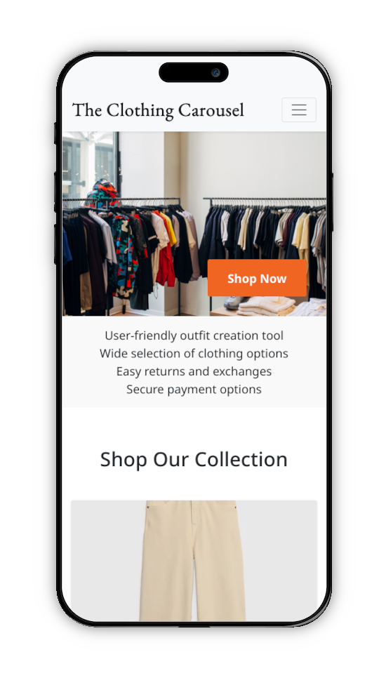
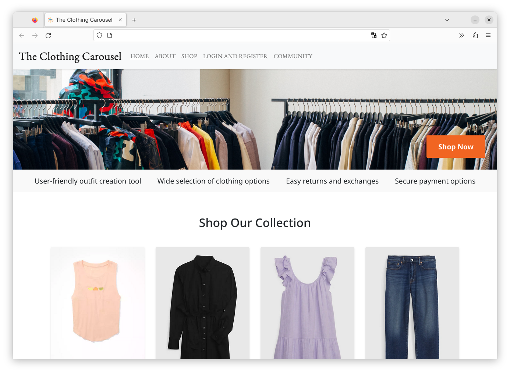

# The Clothing Carousel

This was our group's final project for **CSCI 4710/6710 - Web Applications**. The idea of this website was to have a place
where users could build outfits using a carousel-style selection interface for individual pieces of clothing, giving
them a better idea of how all the pieces would work together.

## Tech Stack

    
     
    
    
    
     
     
    

## Team

<table>
<tr>
    <td>
    
    </td>
    <td>
    
    </td>
    <td>
    
    </td>
</tr>
<tr>
    <td>
    
<a href="https://www.linkedin.com/in/ev-brown-cs-it/">Evan Brown</a>

    </td>
    <td>
    
<a href="https://www.linkedin.com/in/ryanvarnell/">Ryan Varnell</a>

    </td>
    <td>
    
<a href="https://www.linkedin.com/in/cris-zbavitel/">Cris Zbavitel</a>

    </td>
</tr>
<tr>
    <td>
    
<a href="mailto:evbrown1200@gmail.com">evbrown1200@gmail.com</a>

    </td>
    <td>
    
<a href="mailto:mail@ryanvarnell.com">mail@ryanvarnell.com</a>

    </td>
    <td>
    
<a href="mailto:criszbav@gmail.com">criszbav@gmail.com</a>

    </td>
</tr>
</table>

